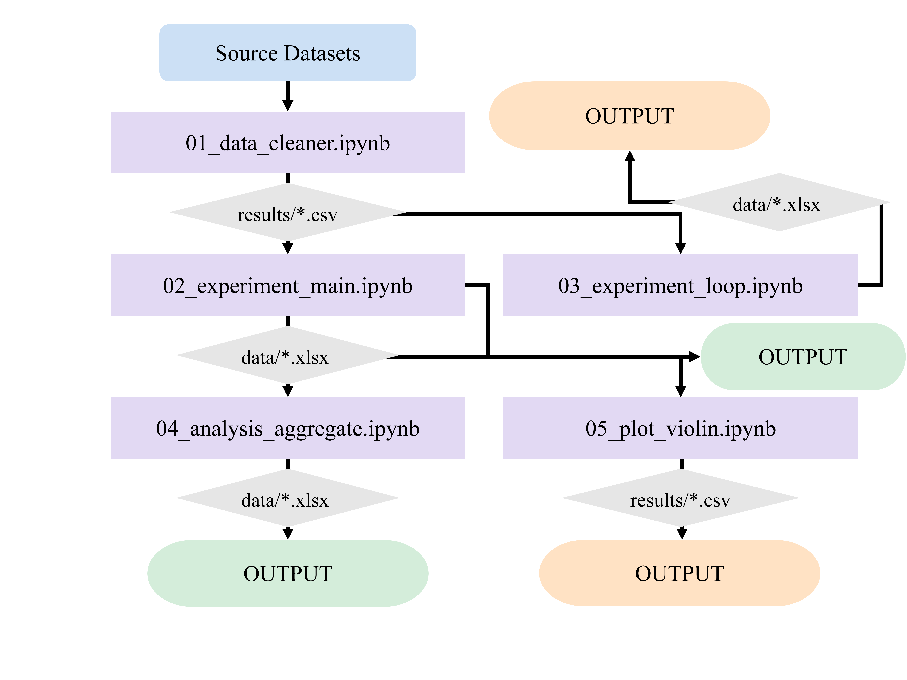

This repository contains the source code and anonymized datasets for SA-SCL, a framework that integrates large language models with time-aware stochastic competitive learning for social network user agent simulation. The framework enables style-aware user modeling, dynamic environment perception, and controllable attitude generation in social contexts. 
 
The code is organized into five sequential Jupyter notebooks that should be executed in numerical order:

01_data_cleaner.ipynb: Loads the pre-cleaned .xlsx files in the data directory and normalizes timestamps for downstream experiments. Bot filtering and deduplication were performed as a separate pre-processing step, and the released datasets are already cleaned.

02_experiment_main.ipynb: Runs the core experiments comparing SA-SCL against four baseline methods (CGAN, Markov Chain, MiniCPM-Only, and TWICE), generating per-dataset evaluation results.

03_experiment_loop.ipynb: Conducts the closed-loop versus open-loop comparison over multiple iterative rounds to evaluate the effect of environmental feedback.

04_analysis_aggregate.ipynb: Aggregates all per-dataset results into summary statistics for cross-method comparison.

05_plot_violin.ipynb: Generates visualization of the composite score distributions for all methods.

All datasets have been fully anonymized, with original usernames replaced by unique identifiers (e.g., user00001). The data directory contains 29 topic-based datasets, each corresponding to a specific hashtag from the X/Twitter platform.

An environment.yml file is provided to create a conda environment with all required dependencies, ensuring reproducible execution. All experiments use fixed random seeds for deterministic results. The output data for Table 2, Table 3, Figure 6, Figure 7, and Figure 8 are provided in the Results/ directory.

An executable software package (.exe) encapsulating the SA-SCL model is scheduled to be released on this data repository by September 2026 (Version 1.1 has been initially developed and was uploaded to the platform on September 14, 2026.). Readers are encouraged to direct any questions or suggestions to the project team at sdrzlwz@126.com. 
